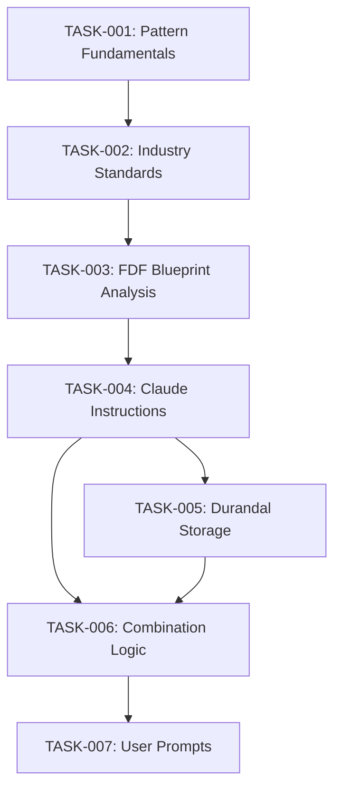

# PASS Data Community Summit Pre-Con Task Orchestration

## Project Overview
Convert Microsoft Fabric Data Factory (FDF) pipelines into reusable design patterns for rapid scaling, testing, and development using Claude Code.

## Task Breakdown with Dependencies

### Task 1: Research Design Pattern Fundamentals
**ID:** TASK-001
**Priority:** HIGH
**Blockers:** None
**Description:** Figure out how a design pattern is designed and made
**Deliverables:**
- Document defining what constitutes a design pattern
- Key components of a design pattern
- Best practices for pattern creation

---

### Task 2: Industry Standards Compliance
**ID:** TASK-002
**Priority:** HIGH
**Blockers:** TASK-001 (must understand patterns first)
**Description:** Figure out how to make design patterns conform to industry standards
**Deliverables:**
- List of relevant industry standards for pipeline patterns
- Compliance checklist
- Template structure adhering to standards

---

### Task 3: FDF Pipeline Blueprint Analysis
**ID:** TASK-003
**Priority:** HIGH
**Blockers:** TASK-001, TASK-002
**Description:** Determine if it's possible to utilize existing FDF pipelines as blueprints for patterns
**Input Files:** `pipeline-content.json` (provided in `/assets/`)
**Deliverables:**
- Analysis of pipeline structure
- Identification of pattern-able components
- Feasibility report

---

### Task 4: Claude Instruction Engineering
**ID:** TASK-004
**Priority:** CRITICAL
**Blockers:** TASK-003
**Description:** Figure out the most efficient method to instruct Claude on converting pipelines to design patterns
**Sub-tasks:**
- Extract parameters from pipeline
- Store parameters separately
- Create conversion logic
**Deliverables:**
- Prompt engineering template
- Parameter extraction algorithm
- Conversion workflow documentation

---

### Task 5: Durandal Storage Integration
**ID:** TASK-005
**Priority:** HIGH
**Blockers:** TASK-004
**Description:** Find out a way to store the design pattern in Durandal for rapid access
**Deliverables:**
- Durandal storage schema for patterns
- Retrieval mechanism
- Claude Code integration approach

---

### Task 6: Pattern-Parameter Combination Logic
**ID:** TASK-006
**Priority:** HIGH
**Blockers:** TASK-004, TASK-005
**Description:** Figure out how to combine the parameters list and design pattern to recreate pipeline
**Deliverables:**
- Combination algorithm
- Validation mechanism
- Test cases with sample data

---

### Task 7: User Prompt Engineering
**ID:** TASK-007
**Priority:** HIGH
**Blockers:** TASK-006
**Description:** Engineer a prompt for users to create new pipelines from patterns and parameters
**Deliverables:**
- User-friendly prompt template
- Parameter input guide
- Validation and error handling prompts

## Task Execution Order

## Claude Code Web Implementation Instructions

1. **Initialize Project**:
   - Clone this repository
   - Review the pipeline file in `/assets/pipeline-content.json`
   - Create a branch for each task using pattern: `task-00X-description`

2. **Task Processing**:
   - Start with TASK-001 (no blockers)
   - Complete tasks sequentially based on dependencies
   - Document findings in `/documentation/task-XXX/`
   - Create deliverables in `/deliverables/task-XXX/`

3. **Communication Protocol**:
   - Update task status in this document
   - Commit changes with format: `[TASK-XXX] Description of change`
   - If blocked, document the blocker and move to next available task

4. **Success Criteria**:
   - All tasks completed with deliverables
   - Working prototype that can convert pipeline to pattern
   - Documentation suitable for PASS presentation

## Resources Provided

- Sample Pipeline: `/assets/pipeline-content.json`
- This orchestration document
- Access to Durandal MCP for storage implementation

## Notes for Claude Code Web

- This is for a pre-con presentation at PASS Data Community Summit
- Focus on creating practical, demonstrable solutions
- Prioritize clarity and educational value in all deliverables
- The goal is to teach attendees how to work with Claude to scale their FDF pipelines